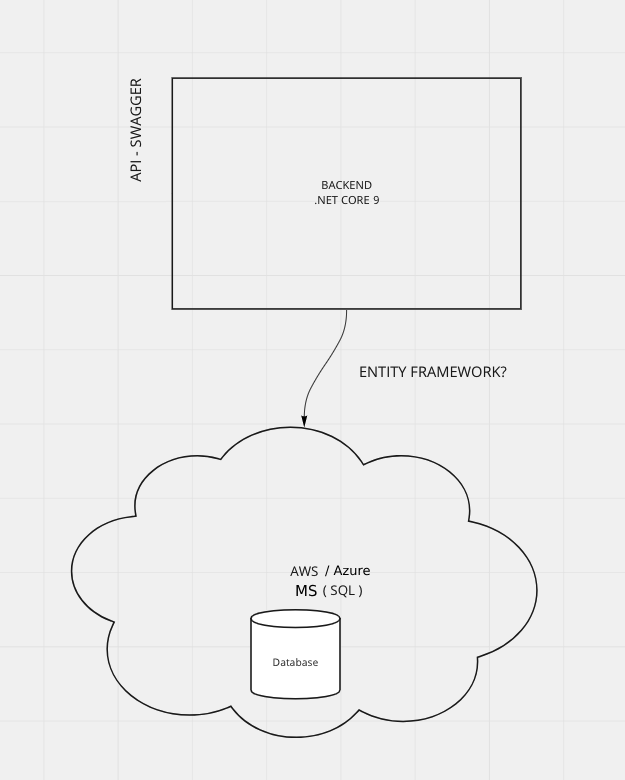
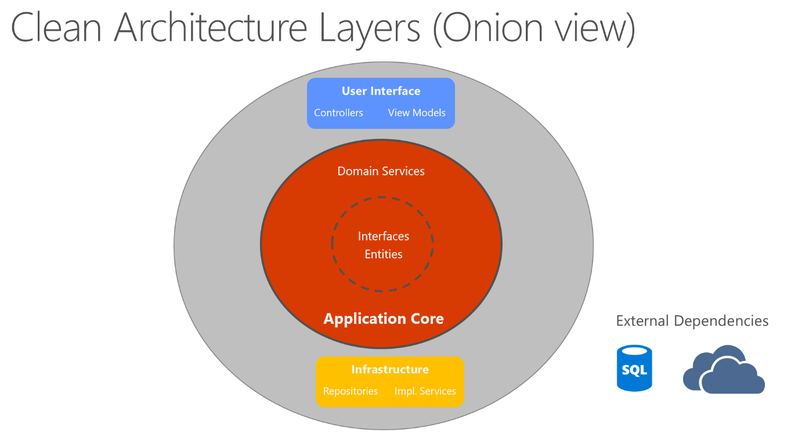

# Zimozi-Web-Api
Zimozi Web Api Assessment

# Zimozi Solutions Assessment
> Started project to manage information and process of Zimozi Solutions Assessment.
> Live demo  comming soon[_here_](https://www.commingsoon.com).

## Table of Contents
* [General Info](#general-information)
* [Technologies Used](#technologies-used)
* [Features](#features)
* [Architecture](#architecture)
* [Develop](#develop)
* [Production](#production)
* [Project Status](#project-status)

## General Information
- This project contains folders: 
- Requirements (Details about architecture)
- Production (project files to publish)
- Source ( Source code for development) 

## Technologies Used
- .Net Web Api 9
- OpenAPI (Swagger)
- Entity Framework Core
- AutoMapper
- FluentValidation
- JWT-based authentication and role-based authorization
- MS SQL
- xUnit

## Features
Update features here:
- Inital Architecture

## Architecture
- Inital Architecture

- Clean Architecture Layers

## Develop
There are one project in source folder, ZimoziSolutions is the backend built on .Net Core 9.

>For .net Core Application must be placed on ~\Zimozi-Web-Api\ZimoziSolutions\

To build application:

`dotnet build`

To run application:

By default, ASP.NET Core apps listen on the following URLs:

https://localhost:7165
http://localhost:5246

To change URL have to run it, with the next command:

`dotnet run or F5`

To create the migration of each modification in the domain entities, it is necessary to open the Package Manager Console in the path: 

Tools --> NuGet Package Manager --> Package Manager Console

To create the modifications in the migration classes, it is necessary to execute the following command:

`add-Migration "Migration Name"`

In the path `Zimozi-Web-Api\ZimoziSolutions\ZimoziSolutions` there is the following file
To handle the connection string to the database
`appsettings.json`

In path `Zimozi-Web-Api\ZimoziSolutions\ZimoziSolutions\SolutionItems` there are the following files
The following files exist:
To handle parameters
`parameters.json`
To handle messages
`texts.json`

The path of these files must be configured in the Constants class in the variables: ParametersFilePath and TextsFilePath.

## Production

By default, publish code has been placed on production folder

To publish .net Core Web Api Application must be placed on ~\Zimozi-Web-Api\ , and execute:

` dotnet publish --output ..\production\ZimoziSolutions`

To create the database and add the changes that have been made, it is necessary to open the Package Manager Console in the path: 

Tools --> NuGet Package Manager --> Package Manager Console

It must be verified that in the console option "Deafult project:", the project "ZimoziSolutions.Infrastructure" is selected.
To include the modifications in the database, it is necessary to execute the following command:

`update-database`

In the path `Zimozi-Web-Api\ZimoziSolutions\ZimoziSolutions` there is the following file
To handle the connection string to the database
`appsettings.json`

In path `Zimozi-Web-Api\ZimoziSolutions\ZimoziSolutions\SolutionItems` there are the following files
The following files exist:
To handle parameters
`parameters.json`
To handle messages
`texts.json`

The path of these files must be configured in the Constants class in the variables: ParametersFilePath and TextsFilePath.

## Project Status
Project is: _in progress_ 
