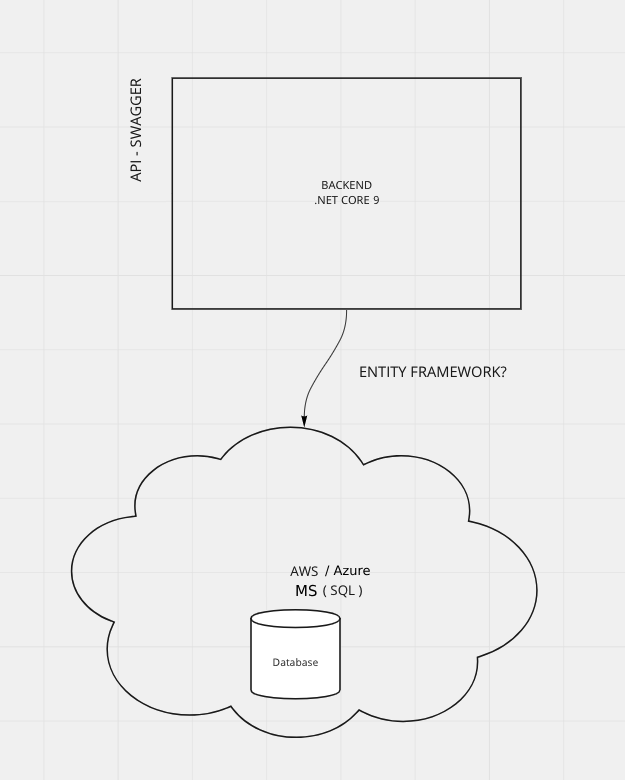
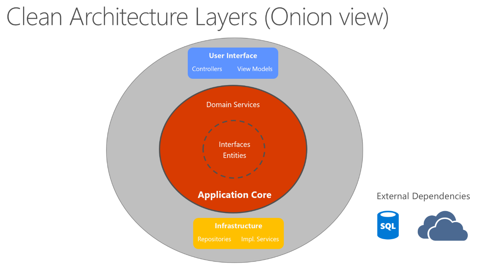

# Zimozi-Web-Api
Zimozi Web Api Assessment

# Zimozi Solutions Assessment
> Started project to manage information and process of Zimozi Solutions Assessment.

## Overview

ZimoziSolutions is a .NET 9 application designed with modular architecture, supporting JWT authentication, Swagger/OpenAPI documentation, and a layered approach for infrastructure, services, and repositories.

# Live demo video
> Live demo video  [_https://www.loom.com/share/4f7f8f64476140c587b1242ff71d5c99?sid=26f7185f-a6b1-4599-b9df-fdc70d331a96_](https://www.loom.com/share/4f7f8f64476140c587b1242ff71d5c99?sid=26f7185f-a6b1-4599-b9df-fdc70d331a96).

> Technical Problem With camera in the Loom Recording App

## Table of Contents
* [General Info](#general-information)
* [Technologies Used](#technologies-used)
* [Features](#features)
* [Architecture](#architecture)
* [Develop](#develop)
* [Production](#production)
* [Project Status](#project-status)

## General Information
- This project contains folders: 
- Requirements (Details about architecture)
- Production (project files to publish)
- Source ( Source code for development) 

## Technologies Used
- .Net Web Api 9
- OpenAPI (Swagger)
- Entity Framework Core
- AutoMapper
- FluentValidation
- JWT-based authentication and role-based authorization
- MS SQL
- xUnit

## Features
Update features here:
- Inital Architecture
- **JWT Authentication**: Secure API endpoints using JSON Web Tokens.
- **Swagger/OpenAPI**: Interactive API documentation for development environments.
- **Modular Architecture**: Separation of concerns via Core, Infrastructure, and Common projects.
- **Entity Framework Core**: SQL Server database integration.
- **Custom Filters**: Exception handling, validation, and result filtering.

## Getting Started

### Prerequisites

- [.NET 9 SDK](https://dotnet.microsoft.com/download)
- SQL Server instance

## Architecture
- Inital Architecture

- Clean Architecture Layers

### Configuration

Edit the `appsettings.json` file with your database connection and JWT settings:
{ "SqlDbConnection": "Your-SQL-Connection-String", "Token": "Your-JWT-Secret", "Issuer": "Your-Issuer", "Audience": "Your-Audience" }

## Develop
There are one project in source folder, ZimoziSolutions is the backend built on .Net Core 9.

>For .net Core Application must be placed on ~\Zimozi-Web-Api\ZimoziSolutions\

To build application:

`dotnet build`

To run application:

By default, ASP.NET Core apps listen on the following URLs:

https://localhost:7165
http://localhost:5246

For Swagger Url:
https://localhost:7165/swagger/index.html

To change URL have to run it, with the next command:

`dotnet run or F5`

To create the migration of each modification in the domain entities, it is necessary to open the Package Manager Console in the path: 

Tools --> NuGet Package Manager --> Package Manager Console

To create the modifications in the migration classes, it is necessary to execute the following command:

`add-Migration "Migration Name"`

In the path `Zimozi-Web-Api\ZimoziSolutions\ZimoziSolutions` there is the following file
To handle the connection string to the database
`appsettings.json`

In path `Zimozi-Web-Api\ZimoziSolutions\ZimoziSolutions\SolutionItems` there are the following files
The following files exist:
To handle parameters
`parameters.json`
To handle messages
`texts.json`

The path of these files must be configured in the Constants class in the variables: ParametersFilePath and TextsFilePath.

## Production

By default, publish code has been placed on production folder

To publish .net Core Web Api Application must be placed on ~\Zimozi-Web-Api\ , and execute:

` dotnet publish --output ..\production\ZimoziSolutions`

To create the database and add the changes that have been made, it is necessary to open the Package Manager Console in the path: 

Tools --> NuGet Package Manager --> Package Manager Console

It must be verified that in the console option "Deafult project:", the project "ZimoziSolutions.Infrastructure" is selected.
To include the modifications in the database, it is necessary to execute the following command:

`update-database`

In the path `Zimozi-Web-Api\ZimoziSolutions\ZimoziSolutions` there is the following file
To handle the connection string to the database
`appsettings.json`

In path `Zimozi-Web-Api\ZimoziSolutions\ZimoziSolutions\SolutionItems` there are the following files
The following files exist:
To handle parameters
`parameters.json`
To handle messages
`texts.json`

The path of these files must be configured in the Constants class in the variables: ParametersFilePath and TextsFilePath.

### API Documentation

- Swagger UI is available at `/swagger` when running in Development environment.

## Project Structure

- `ZimoziSolutions.Common`: Shared constants and configuration classes.
- `ZimoziSolutions.Core`: Business logic and service interfaces.
- `ZimoziSolutions.Infrastructure`: Database context and repository implementations.
- `ZimoziSolutions.Exceptions`: Custom exception and filter classes.
- `ZimoziSolutions`: Main application entry point and API.

## Key Extension Methods

- `AddInfrastructureContext`: Configures EF Core with SQL Server.
- `AddJwtAuthentication`: Sets up JWT authentication.
- `AddSwaggerAndSecurity`: Adds Swagger with JWT support.
- `AddRepositories`: Registers repository services.
- `AddServices`: Registers business logic services.
- `AddMapperConfiguration`: Configures AutoMapper.
- `AddFilterValidation`: Adds MVC filters for exception and validation handling.

## Contributing

1. Fork the repository.
2. Create a feature branch.
3. Commit your changes.
4. Open a pull request.

## License

This project is licensed under the MIT License.

## Project Status
Project is: _in progress_ 
